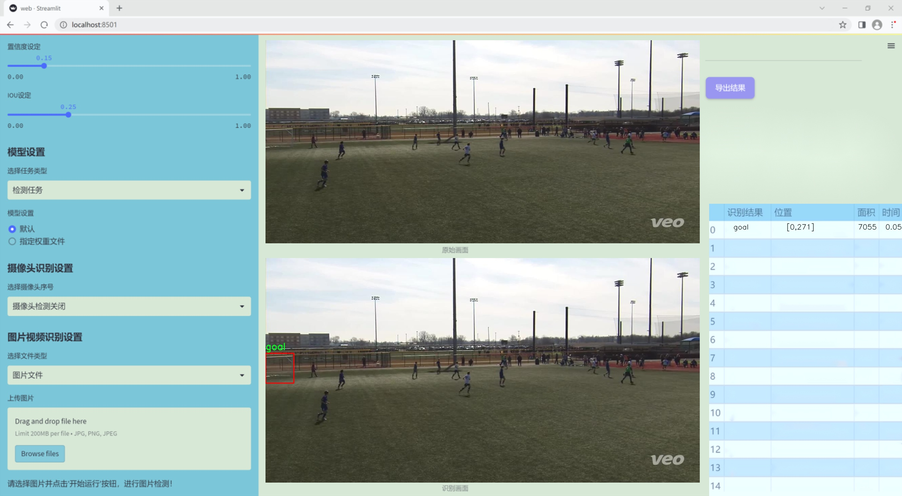
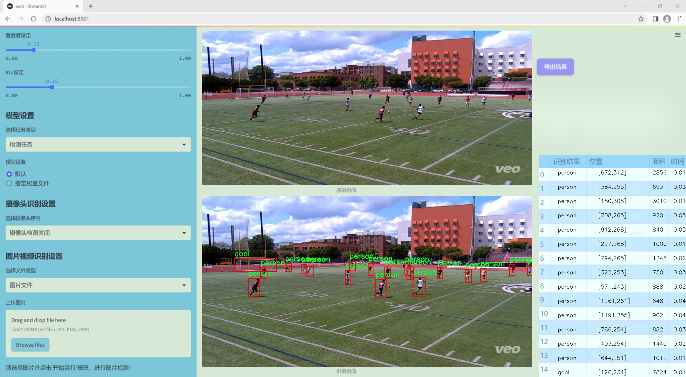
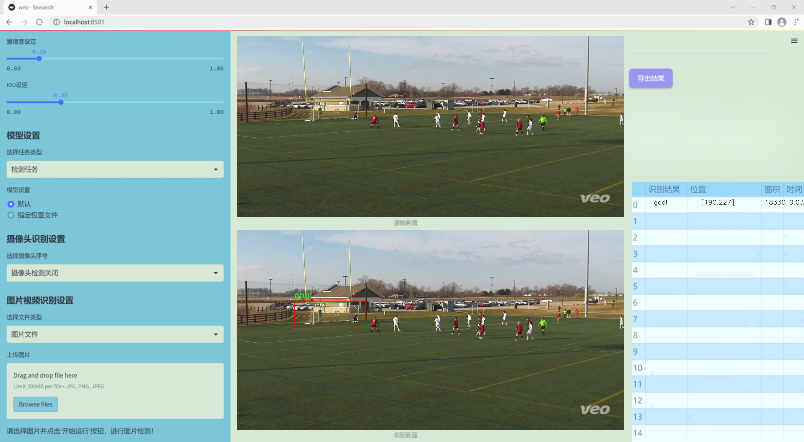
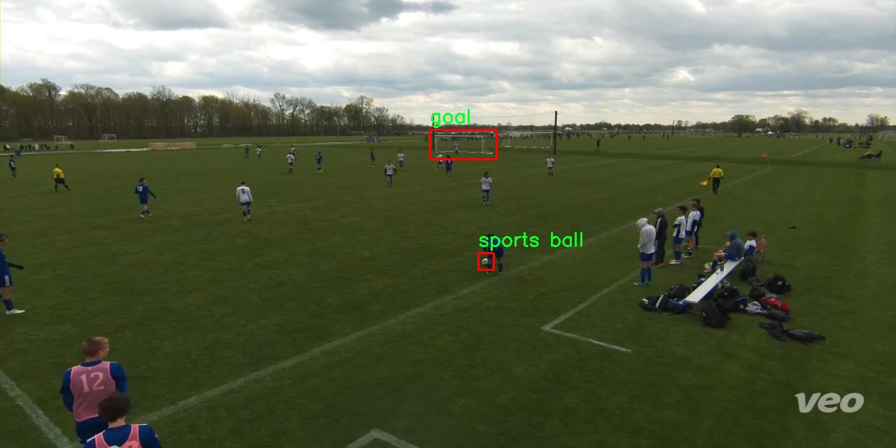
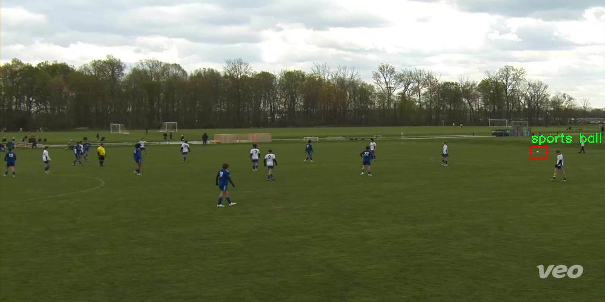
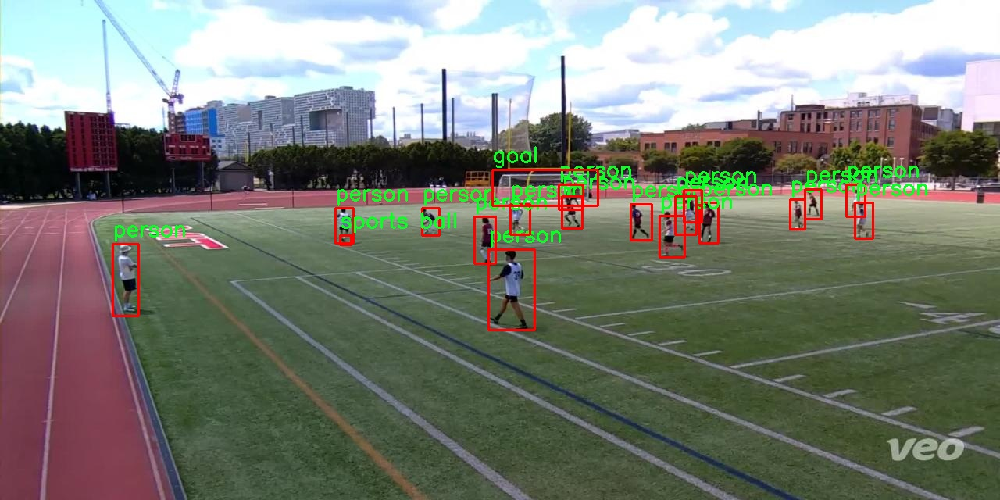
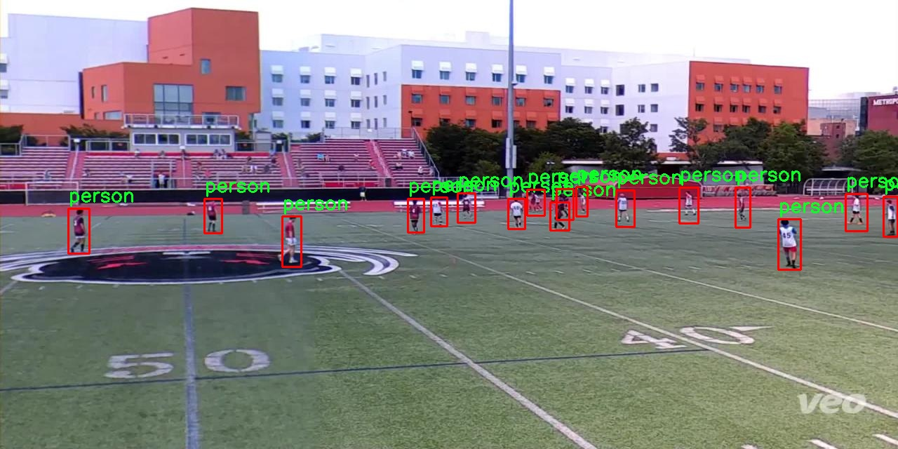
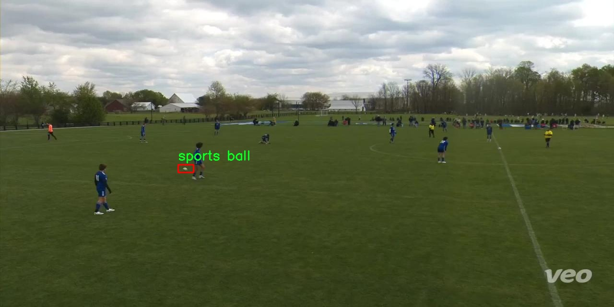

# 改进yolo11-RetBlock等200+全套创新点大全：足球场景目标检测系统源码＆数据集全套

### 1.图片效果展示







##### 项目来源 **[人工智能促进会 2024.11.03](https://kdocs.cn/l/cszuIiCKVNis)**

注意：由于项目一直在更新迭代，上面“1.图片效果展示”和“2.视频效果展示”展示的系统图片或者视频可能为老版本，新版本在老版本的基础上升级如下：（实际效果以升级的新版本为准）

  （1）适配了YOLOV11的“目标检测”模型和“实例分割”模型，通过加载相应的权重（.pt）文件即可自适应加载模型。

  （2）支持“图片识别”、“视频识别”、“摄像头实时识别”三种识别模式。

  （3）支持“图片识别”、“视频识别”、“摄像头实时识别”三种识别结果保存导出，解决手动导出（容易卡顿出现爆内存）存在的问题，识别完自动保存结果并导出到tempDir中。

  （4）支持Web前端系统中的标题、背景图等自定义修改。

  另外本项目提供训练的数据集和训练教程,暂不提供权重文件（best.pt）,需要您按照教程进行训练后实现图片演示和Web前端界面演示的效果。

### 2.视频效果展示

[2.1 视频效果展示](https://www.bilibili.com/video/BV1mtSyYKEsq/)

### 3.背景

研究背景与意义

随着计算机视觉技术的快速发展，目标检测在各个领域的应用愈发广泛，尤其是在体育赛事分析中，目标检测技术的应用能够为赛事的战术分析、运动员表现评估以及观众体验提升提供重要支持。足球作为全球最受欢迎的运动之一，其比赛过程中的动态场景复杂多变，涉及多个目标的实时检测与识别，因此，开发高效、准确的目标检测系统显得尤为重要。

本研究基于改进的YOLOv11模型，旨在构建一个针对足球场景的目标检测系统。该系统将重点识别三类目标：球门、运动员和足球。数据集包含2500张图像，涵盖了丰富的比赛场景，确保了模型训练的多样性和有效性。通过对这些图像的深入分析，我们能够捕捉到足球比赛中目标的动态变化及其相互关系，从而提高目标检测的准确性和实时性。

改进YOLOv11模型的核心在于其高效的特征提取能力和快速的推理速度，适合处理复杂的足球场景。通过引入先进的深度学习技术，我们希望能够提升模型在不同光照、角度和遮挡条件下的鲁棒性。此外，目标检测系统的成功实施不仅能够为教练和分析师提供数据支持，帮助他们制定更有效的战术策略，还能为观众提供更为丰富的比赛解读和互动体验。

综上所述，本研究不仅具有重要的学术价值，还能为足球赛事的智能化分析提供实用的技术支持，推动体育科技的发展。

### 4.数据集信息展示

##### 4.1 本项目数据集详细数据（类别数＆类别名）

nc: 3
names: ['goal', 'person', 'sports ball']


该项目为【目标检测】数据集，请在【训练教程和Web端加载模型教程（第三步）】这一步的时候按照【目标检测】部分的教程来训练

##### 4.2 本项目数据集信息介绍

本项目数据集信息介绍

本项目采用的数据集名为“Soccer Detection”，旨在为改进YOLOv11的足球场景目标检测系统提供高质量的训练数据。该数据集专注于足球比赛中的关键目标物体，包含三类主要目标：球门（goal）、运动员（person）和运动球（sports ball）。通过精心标注的图像，数据集为目标检测算法提供了丰富的样本，确保模型能够在复杂的足球场景中准确识别和定位这些重要元素。

“Soccer Detection”数据集的构建考虑了足球比赛的多样性和复杂性，包含了不同时间、地点和天气条件下的比赛场景。这种多样性不仅增强了模型的泛化能力，还使其能够适应不同的视觉环境。数据集中每一类目标的样本数量经过精心设计，以确保模型在训练过程中能够充分学习到每个类别的特征和变化。例如，球门作为比赛的关键元素，其在场景中的位置和外观可能会因不同的角度和光照条件而有所变化；而运动员的姿态和动作也会因比赛的动态性而变化，运动球则在比赛中频繁移动，增加了检测的难度。

此外，数据集的标注过程采用了严格的标准，确保每个目标的边界框准确无误，极大地提高了训练数据的质量。这些高质量的标注数据为YOLOv11模型的训练提供了坚实的基础，使其能够在实际应用中实现高效的目标检测。通过使用“Soccer Detection”数据集，本项目希望能够显著提升YOLOv11在足球场景中的目标检测性能，为后续的研究和应用提供有力支持。











### 5.全套项目环境部署视频教程（零基础手把手教学）

[5.1 所需软件PyCharm和Anaconda安装教程（第一步）](https://www.bilibili.com/video/BV1BoC1YCEKi/?spm_id_from=333.999.0.0&vd_source=bc9aec86d164b67a7004b996143742dc)


[5.2 安装Python虚拟环境创建和依赖库安装视频教程（第二步）](https://www.bilibili.com/video/BV1ZoC1YCEBw?spm_id_from=333.788.videopod.sections&vd_source=bc9aec86d164b67a7004b996143742dc)

### 6.改进YOLOv11训练教程和Web_UI前端加载模型教程（零基础手把手教学）

[6.1 改进YOLOv11训练教程和Web_UI前端加载模型教程（第三步）](https://www.bilibili.com/video/BV1BoC1YCEhR?spm_id_from=333.788.videopod.sections&vd_source=bc9aec86d164b67a7004b996143742dc)


按照上面的训练视频教程链接加载项目提供的数据集，运行train.py即可开始训练



     Epoch   gpu_mem       box       obj       cls    labels  img_size
     1/200     20.8G   0.01576   0.01955  0.007536        22      1280: 100%|██████████| 849/849 [14:42<00:00,  1.04s/it]
               Class     Images     Labels          P          R     mAP@.5 mAP@.5:.95: 100%|██████████| 213/213 [01:14<00:00,  2.87it/s]
                 all       3395      17314      0.994      0.957      0.0957      0.0843

     Epoch   gpu_mem       box       obj       cls    labels  img_size
     2/200     20.8G   0.01578   0.01923  0.007006        22      1280: 100%|██████████| 849/849 [14:44<00:00,  1.04s/it]
               Class     Images     Labels          P          R     mAP@.5 mAP@.5:.95: 100%|██████████| 213/213 [01:12<00:00,  2.95it/s]
                 all       3395      17314      0.996      0.956      0.0957      0.0845

     Epoch   gpu_mem       box       obj       cls    labels  img_size
     3/200     20.8G   0.01561    0.0191  0.006895        27      1280: 100%|██████████| 849/849 [10:56<00:00,  1.29it/s]
               Class     Images     Labels          P          R     mAP@.5 mAP@.5:.95: 100%|███████   | 187/213 [00:52<00:00,  4.04it/s]
                 all       3395      17314      0.996      0.957      0.0957      0.0845


###### [项目数据集下载链接](https://kdocs.cn/l/cszuIiCKVNis)

### 7.原始YOLOv11算法讲解


##### YOLOv11三大损失函数

YOLOv11（You Only Look Once）是一种流行的目标检测算法，其损失函数设计用于同时优化分类和定位任务。YOLO的损失函数通常包括几个部分：
**分类损失、定位损失（边界框回归损失）和置信度损失** 。其中，

  1. box_loss（边界框回归损失）是用于优化预测边界框与真实边界框之间的差异的部分。

  2. cls_loss（分类损失）是用于优化模型对目标类别的预测准确性的部分。分类损失确保模型能够正确地识别出图像中的对象属于哪个类别。

  3. dfl_loss（Distribution Focal Loss）是YOLO系列中的一种损失函数，特别是在一些改进版本如YOLOv5和YOLOv7中被引入。它的主要目的是解决目标检测中的类别不平衡问题，并提高模型在处理小目标和困难样本时的性能。

##### 边界框回归损失详解

box_loss（边界框回归损失）是用于优化预测边界框与真实边界框之间的差异的部分。


##### box_loss 的具体意义


##### 为什么需要 box_loss

  * 精确定位：通过最小化中心点坐标损失和宽高损失，模型能够更准确地预测目标的位置和大小。
  * 平衡不同类型的目标：使用平方根来处理宽高损失，可以更好地平衡不同大小的目标，确保小目标也能得到足够的关注。
  * 稳定训练：适当的损失函数设计有助于模型的稳定训练，避免梯度爆炸或消失等问题。

##### 分类损失详解

在YOLO（You Only Look
Once）目标检测算法中，cls_loss（分类损失）是用于优化模型对目标类别的预测准确性的部分。分类损失确保模型能够正确地识别出图像中的对象属于哪个类别。下面是关于cls_loss的详细解读：

##### 分类损失 (cls_loss) 的具体意义

  
分类损失通常使用交叉熵损失（Cross-Entropy
Loss）来计算。交叉熵损失衡量的是模型预测的概率分布与真实标签之间的差异。在YOLO中，分类损失的具体形式如下：


##### 为什么需要 cls_loss

  * 类别识别：cls_loss 确保模型能够正确识别出图像中的目标属于哪个类别。这对于目标检测任务至关重要，因为不仅需要知道目标的位置，还需要知道目标的类型。

  * 多类别支持：通过最小化分类损失，模型可以处理多个类别的目标检测任务。例如，在道路缺陷检测中，可能需要识别裂缝、坑洞、路面破损等多种类型的缺陷。

  * 提高准确性：分类损失有助于提高模型的分类准确性，从而提升整体检测性能。通过优化分类损失，模型可以更好地学习不同类别之间的特征差异。

##### 分布损失详解

`dfl_loss`（Distribution Focal
Loss）是YOLO系列中的一种损失函数，特别是在一些改进版本如YOLOv5和YOLOv7中被引入。它的主要目的是解决目标检测中的类别不平衡问题，并提高模型在处理小目标和困难样本时的性能。下面是对`dfl_loss`的详细解读：

##### DFL Loss 的背景

在目标检测任务中，类别不平衡是一个常见的问题。某些类别的样本数量可能远远多于其他类别，这会导致模型在训练过程中对常见类别的学习效果较好，而对罕见类别的学习效果较差。此外，小目标和困难样本的检测也是一个挑战，因为这些目标通常具有较少的特征信息，容易被忽略或误分类。

为了应对这些问题，研究者们提出了多种改进方法，其中之一就是`dfl_loss`。`dfl_loss`通过引入分布焦点损失来增强模型对困难样本的关注，并改善类别不平衡问题。

##### DFL Loss 的定义

DFL Loss
通常与传统的交叉熵损失结合使用，以增强模型对困难样本的学习能力。其核心思想是通过对每个类别的预测概率进行加权，使得模型更加关注那些难以正确分类的样本。

DFL Loss 的公式可以表示为：


##### DFL Loss 的具体意义**

  * **类别不平衡：** 通过引入平衡因子 α，DFL Loss 可以更好地处理类别不平衡问题。对于少数类别的样本，可以通过增加其权重来提升其重要性，从而提高模型对这些类别的检测性能。
  *  **困难样本：** 通过聚焦参数 γ，DFL Loss 可以让模型更加关注那些难以正确分类的样本。当 
  * γ 较大时，模型会对那些预测概率较低的样本给予更多的关注，从而提高这些样本的分类准确性。
  *  **提高整体性能** ：DFL Loss 结合了传统交叉熵损失的优势，并通过加权机制增强了模型对困难样本的学习能力，从而提高了整体的检测性能。


### 8.200+种全套改进YOLOV11创新点原理讲解

#### 8.1 200+种全套改进YOLOV11创新点原理讲解大全

由于篇幅限制，每个创新点的具体原理讲解就不全部展开，具体见下列网址中的改进模块对应项目的技术原理博客网址【Blog】（创新点均为模块化搭建，原理适配YOLOv5~YOLOv11等各种版本）

[改进模块技术原理博客【Blog】网址链接](https://gitee.com/qunmasj/good)


#### 8.2 精选部分改进YOLOV11创新点原理讲解

###### 这里节选部分改进创新点展开原理讲解(完整的改进原理见上图和[改进模块技术原理博客链接](https://gitee.com/qunmasj/good)【如果此小节的图加载失败可以通过CSDN或者Github搜索该博客的标题访问原始博客，原始博客图片显示正常】

### 高效网络架构 CloAtt简介
众所周知，自从 ViTs 提出后，Transformer 基本横扫各大 CV 主流任务，包括视觉识别、目标检测和语义分割等。然而，一个比较棘手的问题就是这个架构参数量和计算量太大，所以一直被广受诟病。因此，后续有不少工作都是朝着这个方向去改进，例如 Swin-Transformer 在局部非重叠窗口中进行注意力计算，而 PVT 中则是使用平均池化来合并 token 以进一步压缩耗时。然而，这些 ViTs 由于其参数量太大以及高 FLOPs 并不适合部署到移动设备。如果我们直接缩小到适合移动设备的尺寸时，它们的性能又会显著降低。


#### MobileViT
因此，出现了不少工作聚焦于探索轻量级的视觉变换器，使 ViTs 适用于移动设备，CVHub 此前也介绍过不少的工作，大家有兴趣可以翻阅历史文章读读。例如，苹果团队提出的 MobileViT 研究了如何将 CNN 与 Transformer 相结合，而另一个工作 MobileFormer 则将轻量级的 MobileNet 与 Transformer 进行融合。此外，最新提出的 EdgeViT 提出了一个局部-全局-局部模块来聚合信息。以上工作的目标都是设计具有高性能、较少参数和低 FLOPs 的移动端友好型模型。


#### EdgeViT
然而，作者从频域编码的角度认为，在现有的轻量级模型中，大多数方法只关注设计稀疏注意力，以有效地处理低频全局信息，而使用相对简单的方法处理高频局部信息。具体而言，大多数模型如 EdgeViT 和 MobileViT，只是简单使用原始卷积提取局部表示，这些方法仅使用卷积中的全局共享权重处理高频本地信息。其他方法，如 LVT ，则是首先将标记展开到窗口中，然后使用窗口内的注意力获得高频信息。这些方法仅使用特定于每个 Token 的上下文感知权重进行局部感知。


#### LVT
虽然上述轻量级模型在多个数据集上取得了良好的结果，但没有一种方法尝试设计更有效的方法，即利用共享和上下文感知权重的优势来处理高频局部信息。基于共享权重的方法，如传统的卷积神经网络，具有平移等变性的特征。与它们不同，基于上下文感知权重的方法，如 LVT 和 NAT，具有可以随输入内容变化的权重。这两种类型的权重在局部感知中都有自己的优势。
#### NAT


受该博客的启发，本文设计了一种轻量级视觉变换器——CloAtt，其利用了上下文感知的局部增强。特别地，CloAtt 采用了双分支设计结构。
#### 局部分支
在局部分支中，本文引入了一个精心设计的 AttnConv，一种简单而有效的卷积操作符，它采用了注意力机制的风格。所提出的 AttnConv 有效地融合了共享权重和上下文感知权重，以聚合高频的局部信息。具体地，AttnConv 首先使用深度卷积（DWconv）提取局部表示，其中 DWconv 具有共享权重。然后，其使用上下文感知权重来增强局部特征。与 Non-Local 等生成上下文感知权重的方法不同，AttnConv 使用门控机制生成上下文感知权重，引入了比常用的注意力机制更强的非线性。此外，AttnConv 将卷积算子应用于 Query 和 Key 以聚合局部信息，然后计算 Q 和 K 的哈达玛积，并对结果进行一系列线性或非线性变换，生成范围在 [-1,1] 之间的上下文感知权重。值得注意的是，AttnConv 继承了卷积的平移等变性，因为它的所有操作都基于卷积。
#### 全局分支
在全局分支中则使用了传统的注意力机制，但对 K 和 V 进行了下采样以减少计算量，从而捕捉低频全局信息。最后，CloFormer 通过简单的方法将局部分支和全局分支的输出进行融合，从而使模型能够同时捕捉高频和低频信息。总的来说，CloFormer 的设计能够同时发挥共享权重和上下文感知权重的优势，提高其局部感知的能力，使其在图像分类、物体检测和语义分割等多个视觉任务上均取得了优异的性能。
如上图2所示，CloFormer 共包含一个卷积主干和四个 stage，每个 stage you Clo 模块 和 ConvFFN 组合而成的模块堆叠而成 。具体得，首先将输入图像通过卷积主干传递，以获取 token 表示。该主干由四个卷积组成，每个卷积的步长依次为2、2、1和1。接下来，tokens 经历四个 Clo 块和 ConvFFN 阶段，以提取分层特征。最后，再利用全局平均池化和全连接层生成预测结果。可以看出，整个架构非常简洁，支持即插即用！


#### ConvFFN
为了将局部信息融入 FFN 过程中，本文采用 ConvFFN 替换了常用的 FFN。ConvFFN 和常用的 FFN 的主要区别在于，ConvFFN 在 GELU 激活函数之后使用了深度卷积（DWconv），从而使 ConvFFN 能够聚合局部信息。由于DWconv 的存在，可以直接在 ConvFFN 中进行下采样而不需要引入 PatchMerge 模块。CloFormer 使用了两种ConvFFN。第一种是在阶段内的 ConvFFN，它直接利用跳跃连接。另一种是连接两个阶段的 ConvFFN，主要用于下采样操作。
#### Clo block
CloFormer 中的 Clo块 是非常关键的组件。每个 Clo 块由一个局部分支和一个全局分支组成。在全局分支中，我们首先下采样 K 和 V，然后对 Q、K 和 V 进行标准的 attention 操作，以提取低频全局信息。
虽然全局分支的设计能够有效减少注意力机制所需的浮点运算次数，并且能够获得全局的感受野。然而，它在处理高频局部信息方面的能力不足。为了解决这个问题，CloFormer 引入了局部分支，并使用 AttnConv 对高频局部信息进行处理。AttnConv 可以融合共享权重和上下文感知权重，能够更好地处理高频局部信息。因此，CloFormer 结合了全局和局部的优势来提高图像分类性能。下面我们重点讲下 AttnConv 。
#### AttnConv
AttnConv 是一个关键模块，使得所提模型能够获得高性能。它结合了一些标准的 attention 操作。具体而言，在AttnConv 中，我们首先进行线性变换以获得 Q、K和V。在进行线性变换之后，我们再对 V 进行共享权重的局部特征聚合。然后，基于处理后的 V 和 Q ，K 进行上下文感知的局部增强。具体流程可对照流程图理解，我们可以将其拆解成三个步骤。
#### Local Feature Aggregation
为了简单起见，本文直接使用一个简单的深度卷积（DWconv）来对 V 进行局部信息聚合。
#### Context-aware Local Enhancement
在将具有共享权重的局部信息整合到 V 中后，我们结合 Q 和 K 生成上下文感知权重。值得注意的是，我们使用了与局部自注意力不同的方法，该方法更加简洁。具体而言，我们首先使用两个 DWconv 对 Q 和 K 分别进行局部信息聚合。然后，我们计算 Q 和 K 的 Hadamard 乘积，并对结果进行一系列转换，以获取在 -1 到 1 之间的上下文感知权重。最后，我们使用生成的权重来增强局部特征。
#### Fusion with Global Branch
在整个 CloFormer 中，我们使用一种简单直接的方法来将局部分支和全局分支的输出进行融合。具体而言，本文是通过将这两个输出在通道维度上进行直接拼接，然后再通过一个 FC 层聚合这些特征并结合残差输出。
最后，上图展示了三种不同的方法。相比于传统卷积，AttnConv 中的上下文感知权重使得模型能够更好地适应输入内容。相比于局部自注意力机制，引入共享权重使得模型能够更好地处理高频信息，从而提高性能。此外，生成上下文感知权重的方法引入了更强的非线性性，也提高了性能。需要注意的是，AttnConv 中的所有操作都基于卷积，保持了卷积的平移等变性特性。


### 9.系统功能展示

图9.1.系统支持检测结果表格显示

  图9.2.系统支持置信度和IOU阈值手动调节

  图9.3.系统支持自定义加载权重文件best.pt(需要你通过步骤5中训练获得)

  图9.4.系统支持摄像头实时识别

  图9.5.系统支持图片识别

  图9.6.系统支持视频识别

  图9.7.系统支持识别结果文件自动保存

  图9.8.系统支持Excel导出检测结果数据


### 10. YOLOv11核心改进源码讲解

#### 10.1 revcol.py

以下是经过简化和注释的核心代码部分：

```python
import torch
import torch.nn as nn

# 定义一个用于反向传播的自定义函数
class ReverseFunction(torch.autograd.Function):
    @staticmethod
    def forward(ctx, run_functions, alpha, *args):
        # 提取传入的函数和参数
        l0, l1, l2, l3 = run_functions
        alpha0, alpha1, alpha2, alpha3 = alpha
        
        # 保存上下文信息
        ctx.run_functions = run_functions
        ctx.alpha = alpha
        
        # 获取输入参数
        x, c0, c1, c2, c3 = args
        
        # 计算每一层的输出
        with torch.no_grad():
            c0 = l0(x, c1) + c0 * alpha0
            c1 = l1(c0, c2) + c1 * alpha1
            c2 = l2(c1, c3) + c2 * alpha2
            c3 = l3(c2, None) + c3 * alpha3
        
        # 保存中间结果以供反向传播使用
        ctx.save_for_backward(x, c0, c1, c2, c3)
        return x, c0, c1, c2, c3

    @staticmethod
    def backward(ctx, *grad_outputs):
        # 获取保存的中间结果
        x, c0, c1, c2, c3 = ctx.saved_tensors
        l0, l1, l2, l3 = ctx.run_functions
        alpha0, alpha1, alpha2, alpha3 = ctx.alpha
        
        # 反向传播计算梯度
        gx_right, g0_right, g1_right, g2_right, g3_right = grad_outputs
        
        # 逐层计算梯度
        # 省略具体实现细节，保持结构
        # ...

        return None, None, gx_up, g0_left, g1_left, g2_left, g3_left

# 定义网络的基本模块
class SubNet(nn.Module):
    def __init__(self, channels, layers, kernel, first_col, save_memory) -> None:
        super().__init__()
        # 初始化参数
        self.save_memory = save_memory
        self.alpha0 = nn.Parameter(torch.ones((1, channels[0], 1, 1)), requires_grad=True)
        self.alpha1 = nn.Parameter(torch.ones((1, channels[1], 1, 1)), requires_grad=True)
        self.alpha2 = nn.Parameter(torch.ones((1, channels[2], 1, 1)), requires_grad=True)
        self.alpha3 = nn.Parameter(torch.ones((1, channels[3], 1, 1)), requires_grad=True)

        # 定义各层
        self.level0 = Level(0, channels, layers, kernel, first_col)
        self.level1 = Level(1, channels, layers, kernel, first_col)
        self.level2 = Level(2, channels, layers, kernel, first_col)
        self.level3 = Level(3, channels, layers, kernel, first_col)

    def forward(self, *args):
        # 根据是否保存内存选择前向传播方式
        if self.save_memory:
            return self._forward_reverse(*args)
        else:
            return self._forward_nonreverse(*args)

# 定义整个网络结构
class RevCol(nn.Module):
    def __init__(self, kernel='C2f', channels=[32, 64, 96, 128], layers=[2, 3, 6, 3], num_subnet=5, save_memory=True) -> None:
        super().__init__()
        self.num_subnet = num_subnet
        self.channels = channels
        self.layers = layers

        # 定义输入层
        self.stem = Conv(3, channels[0], k=4, s=4, p=0)

        # 添加子网络
        for i in range(num_subnet):
            first_col = (i == 0)
            self.add_module(f'subnet{str(i)}', SubNet(channels, layers, kernel, first_col, save_memory=save_memory))

    def forward(self, x):
        # 逐层传递输入
        c0, c1, c2, c3 = 0, 0, 0, 0
        x = self.stem(x)        
        for i in range(self.num_subnet):
            c0, c1, c2, c3 = getattr(self, f'subnet{str(i)}')(x, c0, c1, c2, c3)       
        return [c0, c1, c2, c3]
```

### 代码注释说明：
1. **ReverseFunction**: 这是一个自定义的反向传播函数，主要用于实现反向传播时的梯度计算。
   - `forward` 方法计算前向传播的输出，并保存中间结果。
   - `backward` 方法实现反向传播的梯度计算。

2. **SubNet**: 这是一个子网络模块，包含多个层和参数。
   - `__init__` 方法初始化网络结构和参数。
   - `forward` 方法根据是否保存内存选择前向传播的实现方式。

3. **RevCol**: 这是整个网络的主模块，负责组合多个子网络。
   - `__init__` 方法初始化网络结构，包括输入层和多个子网络。
   - `forward` 方法实现数据的逐层传递。

此代码的核心功能是通过反向传播机制和多个子网络结构实现复杂的神经网络计算。

该文件 `revcol.py` 是一个基于 PyTorch 的深度学习模型实现，主要用于构建一种名为 RevCol 的网络结构。该网络结构结合了反向传播和特征融合的技术，以提高模型的性能和效率。文件中包含多个类和函数，下面对其进行逐一分析。

首先，文件导入了必要的 PyTorch 库以及一些自定义模块。`Conv`、`C2f`、`C3`、`C3Ghost` 和 `C3k2` 等模块可能是实现卷积操作和网络结构的基础组件。

接下来，定义了一些辅助函数：
- `get_gpu_states` 用于获取指定 GPU 设备的随机数生成状态。
- `get_gpu_device` 从输入参数中提取出使用的 GPU 设备。
- `set_device_states` 用于设置 CPU 和 GPU 的随机数生成状态。
- `detach_and_grad` 用于从输入的张量中分离出不需要梯度的部分，并设置需要梯度的标志。
- `get_cpu_and_gpu_states` 返回 CPU 和 GPU 的随机数生成状态。

然后，定义了一个名为 `ReverseFunction` 的类，继承自 `torch.autograd.Function`，实现了自定义的前向和反向传播方法。在前向传播中，该函数接受一系列运行函数和参数，通过一系列的卷积操作和加权（通过 alpha 参数）来计算输出。反向传播中，利用保存的中间状态和梯度信息，逐层计算梯度并进行反向传播。

接着，定义了 `Fusion`、`Level` 和 `SubNet` 类：
- `Fusion` 类负责在不同层之间进行特征融合，包含下采样和上采样的操作。
- `Level` 类代表网络的一个层级，包含融合操作和一系列卷积块。
- `SubNet` 类表示一个子网络，包含多个层级的组合，并根据是否保存内存来选择前向传播的方式（反向或非反向）。

最后，定义了 `RevCol` 类，它是整个模型的主体。该类初始化了多个子网络，并通过 `forward` 方法实现了输入数据的前向传播。模型的输入经过初始卷积层后，依次通过多个子网络进行处理，最终输出多个特征图。

整体来看，该文件实现了一个复杂的深度学习模型，结合了反向传播和特征融合的技术，旨在提高模型的计算效率和性能。通过使用自定义的反向传播函数和灵活的网络结构，RevCol 模型能够在处理高维数据时保持较好的性能。

#### 10.2 activation.py

```python
import torch
import torch.nn as nn

class AGLU(nn.Module):
    """统一激活函数模块，来自 https://github.com/kostas1515/AGLU。"""

    def __init__(self, device=None, dtype=None) -> None:
        """初始化统一激活函数模块。"""
        super().__init__()
        # 使用Softplus作为基础激活函数，beta设置为-1.0
        self.act = nn.Softplus(beta=-1.0)
        # 初始化lambda参数，确保其在训练过程中可学习
        self.lambd = nn.Parameter(nn.init.uniform_(torch.empty(1, device=device, dtype=dtype)))  # lambda参数
        # 初始化kappa参数，确保其在训练过程中可学习
        self.kappa = nn.Parameter(nn.init.uniform_(torch.empty(1, device=device, dtype=dtype)))  # kappa参数

    def forward(self, x: torch.Tensor) -> torch.Tensor:
        """计算统一激活函数的前向传播。"""
        # 将lambda参数限制在最小值0.0001，避免出现负值或零
        lam = torch.clamp(self.lambd, min=0.0001)
        # 计算激活值并返回
        return torch.exp((1 / lam) * self.act((self.kappa * x) - torch.log(lam)))
```

### 代码核心部分说明：
1. **类定义**：`AGLU` 继承自 `nn.Module`，用于定义一个新的激活函数模块。
2. **初始化方法**：
   - `self.act`：使用 `Softplus` 作为基础激活函数，`beta` 参数设置为 -1.0。
   - `self.lambd` 和 `self.kappa`：两个可学习的参数，分别用于调整激活函数的形状和位置。
3. **前向传播方法**：
   - `torch.clamp`：将 `lambd` 限制在最小值 0.0001，以避免计算中的数值不稳定。
   - 返回的值是基于输入 `x` 经过激活函数计算后的结果。

这个程序文件 `activation.py` 定义了一个名为 `AGLU` 的激活函数模块，主要用于深度学习模型中。文件首先导入了 PyTorch 库及其神经网络模块。`AGLU` 类继承自 `nn.Module`，这是 PyTorch 中所有神经网络模块的基类。

在 `AGLU` 类的构造函数 `__init__` 中，首先调用了父类的构造函数 `super().__init__()`，然后初始化了一个激活函数 `nn.Softplus`，其参数 `beta` 被设置为 -1.0。接着，定义了两个可学习的参数 `lambd` 和 `kappa`，这两个参数的初始值是通过均匀分布随机初始化的。它们都是 `nn.Parameter` 类型，这意味着它们会被自动注册为模型的参数，并在训练过程中进行更新。

`forward` 方法实现了前向传播的计算。它接收一个张量 `x` 作为输入，并计算激活函数的输出。在这个方法中，首先对 `lambd` 参数进行限制，确保其值不小于 0.0001，以避免数值不稳定。然后，使用 `torch.exp` 函数计算激活值，该计算涉及到 `Softplus` 激活函数的输出以及 `kappa` 和 `lambd` 参数的运算。

总的来说，这个模块实现了一种新的激活函数，结合了 `Softplus` 和可学习的参数 `lambd` 和 `kappa`，旨在提升深度学习模型的表现。

#### 10.3 conv.py

以下是经过简化并添加详细中文注释的核心代码部分：

```python
import math
import torch
import torch.nn as nn

def autopad(k, p=None, d=1):
    """自动填充以保持输出形状不变。"""
    if d > 1:
        # 计算实际的卷积核大小
        k = d * (k - 1) + 1 if isinstance(k, int) else [d * (x - 1) + 1 for x in k]
    if p is None:
        # 自动计算填充大小
        p = k // 2 if isinstance(k, int) else [x // 2 for x in k]
    return p

class Conv(nn.Module):
    """标准卷积层，包含卷积、批归一化和激活函数。"""

    default_act = nn.SiLU()  # 默认激活函数

    def __init__(self, c1, c2, k=1, s=1, p=None, g=1, d=1, act=True):
        """初始化卷积层，参数包括输入通道数、输出通道数、卷积核大小、步幅、填充、分组数、膨胀率和激活函数。"""
        super().__init__()
        # 定义卷积层
        self.conv = nn.Conv2d(c1, c2, k, s, autopad(k, p, d), groups=g, dilation=d, bias=False)
        # 定义批归一化层
        self.bn = nn.BatchNorm2d(c2)
        # 设置激活函数
        self.act = self.default_act if act is True else act if isinstance(act, nn.Module) else nn.Identity()

    def forward(self, x):
        """前向传播：执行卷积、批归一化和激活函数。"""
        return self.act(self.bn(self.conv(x)))

class DWConv(Conv):
    """深度可分离卷积，使用深度卷积。"""

    def __init__(self, c1, c2, k=1, s=1, d=1, act=True):
        """初始化深度卷积层，参数包括输入通道数、输出通道数、卷积核大小、步幅、膨胀率和激活函数。"""
        super().__init__(c1, c2, k, s, g=math.gcd(c1, c2), d=d, act=act)

class DSConv(nn.Module):
    """深度可分离卷积层，包含深度卷积和逐点卷积。"""

    def __init__(self, c1, c2, k=1, s=1, d=1, act=True):
        super().__init__()
        # 定义深度卷积
        self.dwconv = DWConv(c1, c1, 3)
        # 定义逐点卷积
        self.pwconv = Conv(c1, c2, 1)

    def forward(self, x):
        """前向传播：先进行深度卷积，再进行逐点卷积。"""
        return self.pwconv(self.dwconv(x))

class ConvTranspose(nn.Module):
    """转置卷积层。"""

    default_act = nn.SiLU()  # 默认激活函数

    def __init__(self, c1, c2, k=2, s=2, p=0, bn=True, act=True):
        """初始化转置卷积层，参数包括输入通道数、输出通道数、卷积核大小、步幅、填充、是否使用批归一化和激活函数。"""
        super().__init__()
        self.conv_transpose = nn.ConvTranspose2d(c1, c2, k, s, p, bias=not bn)
        self.bn = nn.BatchNorm2d(c2) if bn else nn.Identity()
        self.act = self.default_act if act is True else act if isinstance(act, nn.Module) else nn.Identity()

    def forward(self, x):
        """前向传播：执行转置卷积、批归一化和激活函数。"""
        return self.act(self.bn(self.conv_transpose(x)))

class ChannelAttention(nn.Module):
    """通道注意力模块。"""

    def __init__(self, channels: int):
        """初始化通道注意力模块，参数为通道数。"""
        super().__init__()
        self.pool = nn.AdaptiveAvgPool2d(1)  # 自适应平均池化
        self.fc = nn.Conv2d(channels, channels, 1, 1, 0, bias=True)  # 1x1卷积
        self.act = nn.Sigmoid()  # 激活函数

    def forward(self, x: torch.Tensor) -> torch.Tensor:
        """前向传播：计算通道注意力并与输入相乘。"""
        return x * self.act(self.fc(self.pool(x)))

class SpatialAttention(nn.Module):
    """空间注意力模块。"""

    def __init__(self, kernel_size=7):
        """初始化空间注意力模块，参数为卷积核大小。"""
        super().__init__()
        assert kernel_size in {3, 7}, "卷积核大小必须为3或7"
        padding = 3 if kernel_size == 7 else 1
        self.cv1 = nn.Conv2d(2, 1, kernel_size, padding=padding, bias=False)  # 卷积层
        self.act = nn.Sigmoid()  # 激活函数

    def forward(self, x):
        """前向传播：计算空间注意力并与输入相乘。"""
        return x * self.act(self.cv1(torch.cat([torch.mean(x, 1, keepdim=True), torch.max(x, 1, keepdim=True)[0]], 1)))

class CBAM(nn.Module):
    """卷积块注意力模块。"""

    def __init__(self, c1, kernel_size=7):
        """初始化CBAM模块，参数为输入通道数和卷积核大小。"""
        super().__init__()
        self.channel_attention = ChannelAttention(c1)  # 通道注意力
        self.spatial_attention = SpatialAttention(kernel_size)  # 空间注意力

    def forward(self, x):
        """前向传播：依次通过通道注意力和空间注意力模块。"""
        return self.spatial_attention(self.channel_attention(x))
```

### 代码说明：
1. **autopad**: 计算卷积时的自动填充，以保持输出的形状与输入相同。
2. **Conv**: 标准卷积层，包含卷积、批归一化和激活函数的组合。
3. **DWConv**: 深度卷积层，使用深度可分离卷积的方式。
4. **DSConv**: 深度可分离卷积，结合深度卷积和逐点卷积。
5. **ConvTranspose**: 转置卷积层，常用于上采样。
6. **ChannelAttention**: 实现通道注意力机制，通过自适应池化和1x1卷积来增强特征。
7. **SpatialAttention**: 实现空间注意力机制，通过对输入特征的平均和最大池化进行处理。
8. **CBAM**: 结合通道注意力和空间注意力的模块，增强特征表示能力。

这个程序文件 `conv.py` 定义了一系列用于卷积操作的模块，主要用于深度学习中的卷积神经网络（CNN）。文件中包含多个类和函数，提供了不同类型的卷积层和相关操作，适用于图像处理和计算机视觉任务。

首先，文件引入了必要的库，包括 `math`、`numpy` 和 `torch`，并定义了一个名为 `autopad` 的函数，该函数用于自动计算卷积操作的填充，以确保输出形状与输入形状相同。该函数根据给定的卷积核大小、填充和扩张参数来计算所需的填充量。

接下来，定义了多个卷积相关的类。`Conv` 类是一个标准的卷积层，包含卷积操作、批归一化和激活函数。构造函数中接受多个参数，如输入通道数、输出通道数、卷积核大小、步幅、填充、分组和扩张等。`forward` 方法实现了前向传播，依次应用卷积、批归一化和激活函数。

`Conv2` 类是对 `Conv` 类的扩展，增加了一个 1x1 的卷积层，并在前向传播中将两个卷积的输出相加。它还提供了一个 `fuse_convs` 方法，用于融合卷积操作以提高计算效率。

`LightConv` 类实现了一种轻量级卷积，结合了标准卷积和深度卷积（`DWConv`）。`DWConv` 类则实现了深度卷积，主要用于减少模型参数和计算量。

`DSConv` 类实现了深度可分离卷积，它将深度卷积和逐点卷积结合在一起，以提高效率。

`DWConvTranspose2d` 和 `ConvTranspose` 类分别实现了深度转置卷积和标准转置卷积，用于上采样操作。

`Focus` 类用于将空间信息聚焦到通道维度，通过对输入张量进行特定的切片和拼接操作来实现。

`GhostConv` 类实现了 Ghost 卷积，通过主卷积和便宜的操作来高效地学习特征。

`RepConv` 类实现了一种重复卷积模块，支持训练和推理状态，并提供了融合卷积的功能，以提高推理速度。

`ChannelAttention` 和 `SpatialAttention` 类实现了通道注意力和空间注意力机制，分别用于对特征图的通道和空间信息进行加权，以增强重要特征。

`CBAM` 类结合了通道注意力和空间注意力，形成一个卷积块注意力模块，用于进一步增强特征表示。

最后，`Concat` 类用于在指定维度上连接多个张量，常用于特征融合。

整体来看，这个文件实现了多种卷积操作和注意力机制，提供了灵活的构建模块，适用于各种深度学习模型，尤其是在目标检测和图像分割等任务中。

#### 10.4 convnextv2.py

以下是经过简化和注释的核心代码部分：

```python
import torch
import torch.nn as nn
import torch.nn.functional as F

class LayerNorm(nn.Module):
    """ 自定义的层归一化，支持两种数据格式：channels_last（默认）和 channels_first。
    channels_last 对应的输入形状为 (batch_size, height, width, channels)，
    而 channels_first 对应的输入形状为 (batch_size, channels, height, width)。
    """
    def __init__(self, normalized_shape, eps=1e-6, data_format="channels_last"):
        super().__init__()
        # 权重和偏置参数
        self.weight = nn.Parameter(torch.ones(normalized_shape))
        self.bias = nn.Parameter(torch.zeros(normalized_shape))
        self.eps = eps
        self.data_format = data_format
        if self.data_format not in ["channels_last", "channels_first"]:
            raise NotImplementedError 
        self.normalized_shape = (normalized_shape, )
    
    def forward(self, x):
        # 根据数据格式进行归一化
        if self.data_format == "channels_last":
            return F.layer_norm(x, self.normalized_shape, self.weight, self.bias, self.eps)
        elif self.data_format == "channels_first":
            u = x.mean(1, keepdim=True)  # 计算均值
            s = (x - u).pow(2).mean(1, keepdim=True)  # 计算方差
            x = (x - u) / torch.sqrt(s + self.eps)  # 标准化
            x = self.weight[:, None, None] * x + self.bias[:, None, None]  # 应用权重和偏置
            return x

class Block(nn.Module):
    """ ConvNeXtV2的基本模块，包含深度可分离卷积和全连接层等。
    
    Args:
        dim (int): 输入通道数。
    """
    def __init__(self, dim):
        super().__init__()
        # 深度可分离卷积
        self.dwconv = nn.Conv2d(dim, dim, kernel_size=7, padding=3, groups=dim)
        self.norm = LayerNorm(dim, eps=1e-6)  # 归一化层
        self.pwconv1 = nn.Linear(dim, 4 * dim)  # 1x1卷积
        self.act = nn.GELU()  # 激活函数
        self.pwconv2 = nn.Linear(4 * dim, dim)  # 1x1卷积

    def forward(self, x):
        input = x
        x = self.dwconv(x)  # 深度卷积
        x = x.permute(0, 2, 3, 1)  # 转换维度顺序
        x = self.norm(x)  # 归一化
        x = self.pwconv1(x)  # 1x1卷积
        x = self.act(x)  # 激活
        x = self.pwconv2(x)  # 1x1卷积
        x = x.permute(0, 3, 1, 2)  # 恢复维度顺序
        return input + x  # 残差连接

class ConvNeXtV2(nn.Module):
    """ ConvNeXt V2模型，包含多个特征分辨率阶段和残差块。
    
    Args:
        in_chans (int): 输入图像的通道数。默认值为3。
        num_classes (int): 分类头的类别数。默认值为1000。
        depths (tuple(int)): 每个阶段的块数。默认值为[3, 3, 9, 3]。
        dims (int): 每个阶段的特征维度。默认值为[96, 192, 384, 768]。
    """
    def __init__(self, in_chans=3, num_classes=1000, 
                 depths=[3, 3, 9, 3], dims=[96, 192, 384, 768]):
        super().__init__()
        self.downsample_layers = nn.ModuleList()  # 下采样层
        # 初始卷积层
        stem = nn.Sequential(
            nn.Conv2d(in_chans, dims[0], kernel_size=4, stride=4),
            LayerNorm(dims[0], eps=1e-6, data_format="channels_first")
        )
        self.downsample_layers.append(stem)
        # 添加下采样层
        for i in range(3):
            downsample_layer = nn.Sequential(
                LayerNorm(dims[i], eps=1e-6, data_format="channels_first"),
                nn.Conv2d(dims[i], dims[i+1], kernel_size=2, stride=2),
            )
            self.downsample_layers.append(downsample_layer)

        self.stages = nn.ModuleList()  # 特征分辨率阶段
        for i in range(4):
            stage = nn.Sequential(
                *[Block(dim=dims[i]) for _ in range(depths[i])]
            )
            self.stages.append(stage)

        self.norm = nn.LayerNorm(dims[-1], eps=1e-6)  # 最后的归一化层
        self.head = nn.Linear(dims[-1], num_classes)  # 分类头

    def forward(self, x):
        for i in range(4):
            x = self.downsample_layers[i](x)  # 下采样
            x = self.stages[i](x)  # 通过阶段
        return x  # 返回最后的特征图
```

### 代码注释说明：
1. **LayerNorm类**：实现了自定义的层归一化，支持不同的数据格式，确保在不同维度下的归一化处理。
2. **Block类**：构建了ConvNeXtV2的基本模块，包含深度可分离卷积、归一化、激活函数和残差连接。
3. **ConvNeXtV2类**：整体模型的构建，包含多个下采样层和特征提取阶段，每个阶段由多个Block组成，最终输出分类结果。

这个程序文件实现了一个名为 ConvNeXt V2 的深度学习模型，主要用于图像分类任务。代码中包含了多个类和函数，下面是对其主要部分的讲解。

首先，文件引入了必要的库，包括 PyTorch 和一些辅助函数。接着，定义了一个 `LayerNorm` 类，它实现了层归一化功能，支持两种数据格式：通道最后（channels_last）和通道第一（channels_first）。在 `forward` 方法中，根据输入数据的格式进行不同的归一化处理。

接下来，定义了一个 `GRN` 类，表示全局响应归一化层。该层通过计算输入的 L2 范数来进行归一化，并使用可学习的参数 `gamma` 和 `beta` 来调整输出。

然后，定义了 `Block` 类，这是 ConvNeXt V2 的基本构建块。每个块包含一个深度可分离卷积层、层归一化、点卷积、激活函数（GELU）、GRN 和另一个点卷积。该块还实现了随机深度（Drop Path）机制，以增强模型的泛化能力。

`ConvNeXtV2` 类是整个模型的主体。它的构造函数接受输入通道数、分类类别数、每个阶段的块数、特征维度、随机深度率等参数。模型的结构由多个下采样层和特征提取阶段组成。下采样层使用卷积和层归一化逐步减少特征图的空间维度，而特征提取阶段则由多个 `Block` 组成，负责提取更深层次的特征。

在 `ConvNeXtV2` 类中，还定义了 `_init_weights` 方法，用于初始化模型的权重，使用截断正态分布和常数初始化。

`forward` 方法实现了模型的前向传播，依次通过下采样层和特征提取阶段，并将每个阶段的输出存储在 `res` 列表中。

此外，文件中还定义了一个 `update_weight` 函数，用于更新模型的权重字典，确保模型和权重的形状匹配。

最后，提供了一系列函数（如 `convnextv2_atto`、`convnextv2_femto` 等），用于创建不同规模的 ConvNeXt V2 模型。这些函数允许用户指定预训练权重，并加载到相应的模型中。

总体而言，这个文件实现了一个灵活且可扩展的深度学习模型，适用于各种图像分类任务，并提供了多种不同规模的模型配置。

注意：由于此博客编辑较早，上面“10.YOLOv11核心改进源码讲解”中部分代码可能会优化升级，仅供参考学习，以“11.完整训练+Web前端界面+200+种全套创新点源码、数据集获取”的内容为准。

### 11.完整训练+Web前端界面+200+种全套创新点源码、数据集获取


# [下载链接：https://mbd.pub/o/bread/Z5WWmJ9p](https://mbd.pub/o/bread/Z5WWmJ9p)